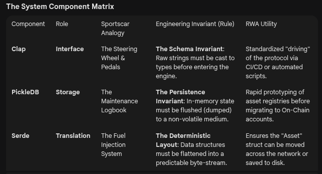

rust_task_manager/

├── Cargo.toml          # The Manifest

├── src/

│   ├── main.rs         # The Ignition: Entry point

│   ├── lib.rs          # The Registry: Public 
module declarations

│   ├── errors.rs       # The Check Engine Light: Custom Errors

│   ├── engine/         # The Powertrain

│   │   ├── mod.rs      # Engine API

│   │   ├── model.rs    # The Person/Asset Struct

│   │   └── storage.rs  # The Garage (PickleDB Logic)

│   └── commands/       # The Dashboard Controls

│       ├── mod.rs      # Command Dispatcher & Enum

│       ├── add.rs      # Logic for 'Add'

│       ├── list.rs     # Logic for 'List'

│       └── delete.rs   # Logic for 'Delete'

└── assets.db           # (Created automatically)

### . Engineering Comparison: The Trade-offsComponent

